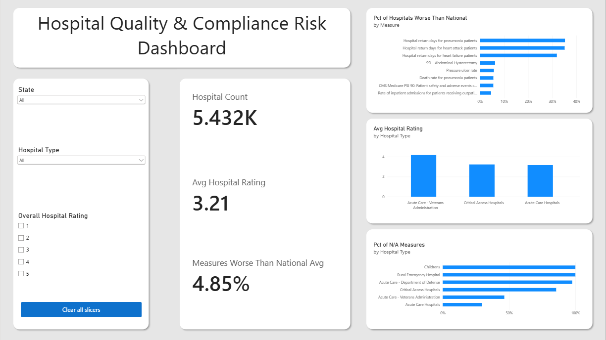
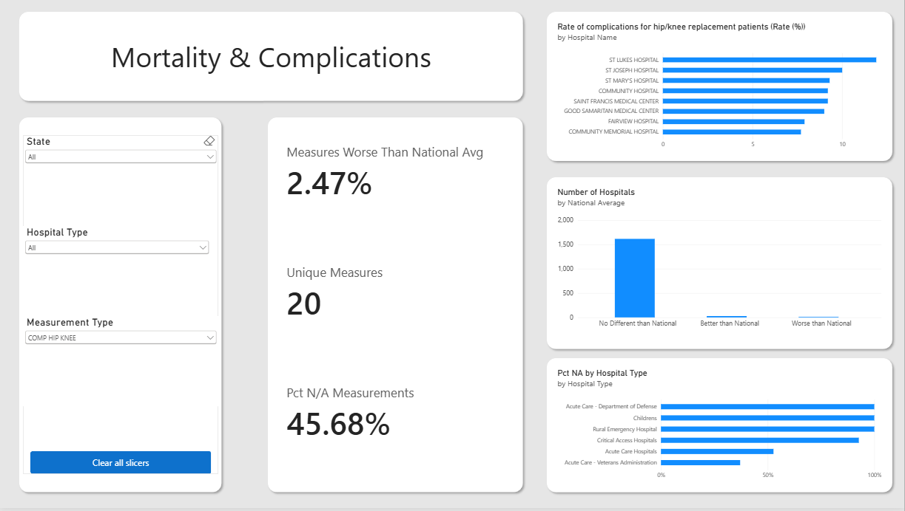
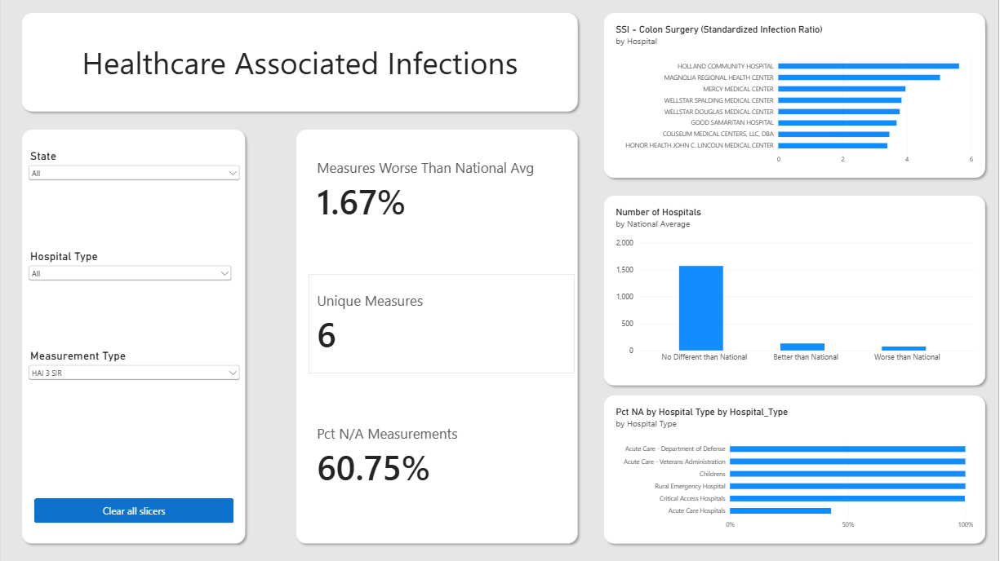
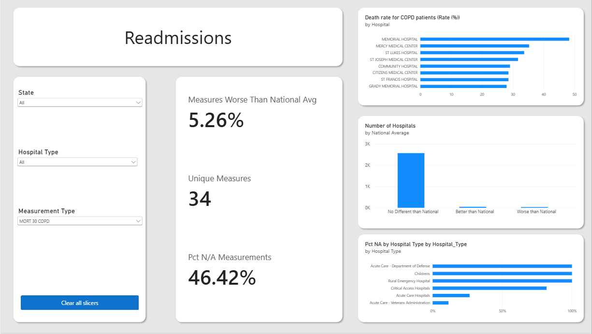

# Hospital Quality & Compliance Risk Dashboard

An interactive Power BI dashboard analyzing hospital quality data from the Centers for Medicare & Medicaid Services (CMS) Provider Data Catalog, built to identify patterns relevant to compliance and quality risk screening across U.S. hospitals.

## Overview

This project uses publicly available CMS hospital quality data to explore mortality/complication rates, hospital readmissions, and healthcare-associated infections across ~5,400 U.S. hospitals. It was built as a self-directed learning project to develop skills in SQL Server, data modeling, and Power BI/DAX, with a focus on healthcare analytics.

**Note on scope:** This project was initially started to investigate The Joint Commission (TJC) hospital accreditation compliance. However, TJC survey and inspection results are not publicly available, so the project pivoted to CMS's publicly available hospital quality measures as the closest accessible proxy for compliance and quality risk screening. CMS quality reporting and Joint Commission accreditation are related but distinct frameworks.

## Tech Stack

- **SQL Server** — data storage, cleaning, and transformation
- **Python (pandas, SQLAlchemy)** — CSV ingestion into SQL Server
- **Power BI Desktop** — dashboard and visualization
- **DAX** — dynamic measures and filter-context calculations

## Data Source

Five datasets from the [CMS Provider Data Catalog](https://data.cms.gov/provider-data/topics/hospitals):
- Hospital General Information
- Complications and Deaths
- Unplanned Hospital Visits
- Healthcare-Associated Infections

## Methodology

### 1. Data Cleaning & Standardization (SQL Server)
Raw CMS data required significant cleaning before analysis:
- **Inconsistent comparison labels**: The `Compared to National` field used different wording across tables (e.g., "Worse Than the National Rate" vs. "Worse than the National Benchmark" vs. "Worse than expected") — standardized into four consistent categories: Better/Worse/No Different/Not Available.
- **Mixed measurement units**: Some tables combined rate-based measures (%), day-count measures, and composite ratios in the same column — added a `Score_Unit` classification to prevent invalid comparisons across incompatible units.
- **Redundant sub-measures**: The infections dataset included six rows per infection type (confidence intervals, case counts, etc.) for every one meaningful score, this was filtered to the primary Standardized Infection Ratio (SIR) value only.

### 2. Data Modeling (Star Schema)
Built a simple star schema in SQL Server:
- `vw_Hospital_Dimension` — one row per hospital (name, state, type, ownership, rating)
- `vw_All_Measures` — a unified, standardized view combining mortality/complications, readmissions, and infections measures, related to the dimension table via `Facility_ID`

### 3. Dashboard (Power BI)
Four pages: an overview, and one detail page per measure category (Mortality/Complications, Readmissions, Infections), each with consistent slicers, KPI cards, and chart types for a cohesive user experience.

## Key Findings

### 1. Post-discharge return days for pneumonia, heart attack, and heart failure patients represent the largest concentration of compliance risk in the dataset
- Roughly 1 in 3 hospitals scored worse than the national average on these three measures, or more than five times the rate of the next-highest measure in the entire dataset. This concentration suggests post-discharge care coordination for these three high-volume conditions represents the clearest, most consistent opportunity for hospital-level quality improvement identified in this analysis.

### 2. Hospital star ratings track meaningfully with actual measure performance
- Comparing CMS's Overall Hospital Rating (1-5 stars) against the ratio of "Better than National" to "Worse than National" measures per rating tier showed a consistent, monotonic trend: lower-rated hospitals skewed toward more "Worse" than "Better" outcomes, while higher-rated hospitals skewed sharply the other way

### 3. Data completeness varies sharply by hospital type
- Smaller and Specialized facilites often don't perform enough of the relevant procedures to generate a statistically reliable measure. Due to this, comparative analysis is most meaningful when applied specifically to acute care hospitals.

## Limitations

- CMS quality measures are a proxy for, not a direct measure of, Joint Commission compliance status.
- Small sample sizes for some hospital types (e.g., 112 for rated VA hospitals vs. 2,670 for Acute Care) limit the reliability comparisons between hospital types.
- Data reflects a single CMS reporting period and does not capture trends over time.

## Dashboard Pages

1. **Overview** — hospital counts, overall rating distribution, national data coverage
2. **Mortality & Complications** — measure-level detail, hospital rankings, coverage by type
3. **Readmissions & Unplanned Visits** — same structure, scoped to readmission measures
4. **Healthcare-Associated Infections** — same structure, scoped to infection SIR measures

## Screenshots

